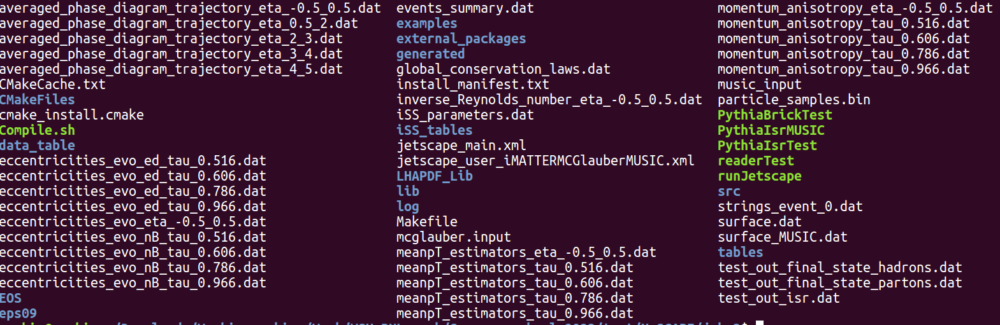
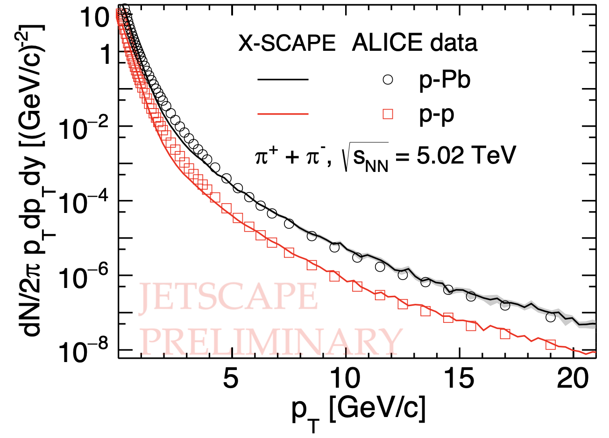
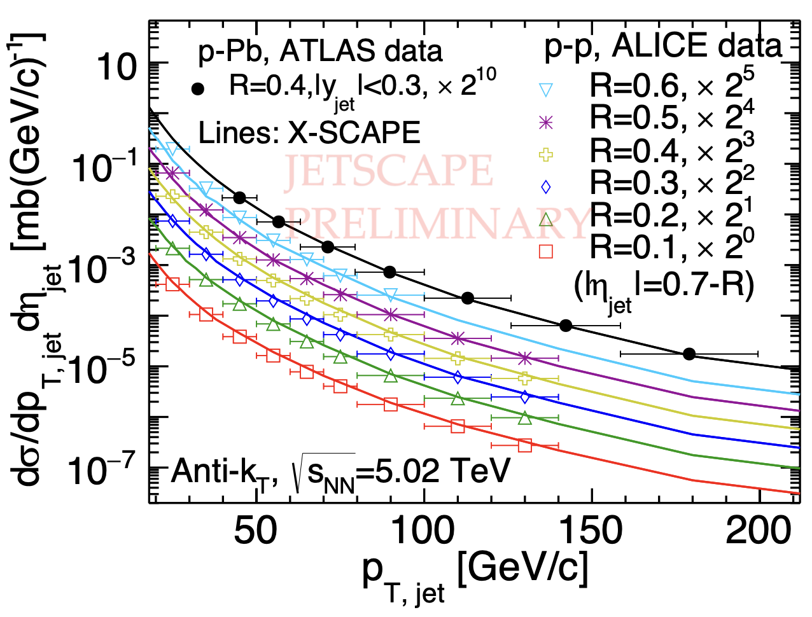

# Preparation for the 2023 JETSCAPE School

Please carefully complete **all** of the below instructions **by Wednesday July 19**.

In case of problems please head to the slack (you can find the link on the indico page) and ask in the `software-install-problems` channel.

# Table of contents
- **Part I. Introduction**
  - i. Background
  - ii. Goals
- **Part II. Build the X-SCAPE framework**
  - i. Prerequisite: Download necessary code packages
  - ii. Set up a docker container
  - iii. Build X-SCAPE with 3DGlauber, iMATTER, MUSIC and iSS
- **Part III. Get ready for the Hydro Session**
  - i. Copy Hydro Session scripts to the working directory
  - ii. Visualization with Jupyter Notebook
  - iii. Setup with different parameter files
- **Part IV. Run the X-SCAPE framework**
  - Exercise 1. Run 3DGlauber, get some intuition on the dynamical initial condition.
  - Exercise 2. Run X-SCPAE code, get some intuition on the soft-hard correlations in small systems.
  - Exercise 3. Run full X-SCAPE code, understand the whole process, and get some results.

- **Homework**
  - Reproduce the hadron $p_T$-spectra and jet $p_T$-spectra in p-p at 5.02 TeV.
  
# Part I. Introduction 

> Note: Please join the Slack Channel: [# july19-bulk-dynamics](https://jetscape2023o-d166455.slack.com/archives/C05G3P2QN5V) and post your questions there.

> Previous Hydro Sessions at [Summer School 2022](https://github.com/JETSCAPE/SummerSchool2023/tree/main/July19_Hydro)(Lecturer: Lipei Du).
[Summer School 2021](https://github.com/JETSCAPE/SummerSchool2021/tree/master/Jul21_Hydro/hydro_session) and [Summer School 2020](https://github.com/JETSCAPE/SummerSchool2020/tree/master/hydro_session) (Lecturer: Chun Shen).

## (1) Background

The **X**-ion collisions with a **S**tatistically and **C**omputationally **A**dvanced **P**rogram **E**nvelope (X-SCAPE) is the enhanced (and 2nd) project of the JETSCAPE collaboration which extends the framework to include small systems created in p-A and p-p collisions, lower energy heavy-ion collisions and electron-Ion collisions. The new framework allows for novel functionality such as the ability of the main simulation clock to go backwards and forwards, to deal systematically with initial state and final state evolution. It allows for multiple bulk event generators to run concurrently while exchanging information via a new Bulk Dynamics Manager.  We will use the following modules within the X-SCAPE framework for the Hydro Session today:

```c++
'PYTHIA8' (initial hard parton) + '3DGlauber' (initial condition) + 'iMATTER' (parton shower) 
+ 'MUSIC' (hydrodynamics) + 'iSS' (particlization)
```

The first hard scattering is sampled using `PYTHIA8`. The `iMatter` models the backward initial-state parton shower for the produced high-energy particles. Then the hard energy of hard partons are subtracted in the `3DGlauber`. The subtracted  `3DGlauber` generates the initial condition for hydrodynamic module `MUSIC`, which will evolve the collision system starting as a hot QGP to a hadron gas. `iSS` particle sampler converts the fluid cells to individual hadrons, including resonance decays. Finally, `PYTHIA8` is used to hadronize the shower particles from `iMatter` with the collision remnants provided by the `3DGlauber` model.

## (2) Goals

- In this Hydro Session, participants will understand how to run X-SCAPE with a few default modules;

- With 3DGlauber model, participants will understand the dynamical initial condition at low energies, and the asymmetries for the asymmetric light nuclei + heavy nucleus collisions.

- Participants will run X-SCAPE code to understand the soft-hard correlations in small systems, understand the X-SCAPE output, and calculate some basic observables like hadron and jet $p_T$-spectra from low $p_T$ to high $p_T$.


# Part II. Build the X-SCAPE framework

## (1) Download school material

We will use code from several git repositories throughout the course of the school,
which you will run in a controlled software environment (docker). 
Create a single directory to store all materials from the school:

```bash
mkdir jetscape-docker
cd jetscape-docker
```

In what follows we assume such a directory at `~/jetscape-docker`. You may decide to name your directory something else,
but if so **please be careful to substitute your directory name appropriately in the remainder of the instructions**.

Then download several pieces of software from git:

```bash
git clone https://github.com/JETSCAPE/X-SCAPE.git
git clone https://github.com/JETSCAPE/SummerSchool2023.git
```

Additionally, download a few external physics packages:
```bash
cd X-SCAPE/external_packages
./get_3dglauber.sh
./get_music.sh
./get_iSS.sh
```

Now please make sure all the code packages are already in the correct place on your computer. You should have a `jetscape-docker` folder under your `home` directory. Try to list the folders inside `jetscape-docker` with the following command,

```bash
ls ~/jetscape-docker
```

and you should see `X-SCAPE` and `SummerSchool2023`  present. If you list folders inside `~/jetscape-docker/X-SCAPE/external_packages` with

```shell
ls ~/jetscape-docker/X-SCAPE/external_packages
```

you should see `3dMCGlauber`, `music` and `iSS` folders present. **They are modules needed for the Hydro Session.**

## (2) Install docker

Docker is a software tool that allows one to deploy an application in a portable environment. 
A docker "image" can be created for the application, allowing any user to run a docker "container" from this image.
We have prepared a docker image for the JETSCAPE environment, which allows you to use JETSCAPE on any operating system without
installing a long list of pre-reqs or worrying about interference with software you already have installed.

To illustrate what this will look like, consider the following standard workflow. 
In a terminal on your machine (call it Terminal 1), you will clone JETSCAPE &mdash; this terminal is on your "host" machine &mdash; 
just a standard, typical terminal. In another terminal (call it Terminal 2), you will invoke a command that runs a pre-defined docker container. 
Terminal 2 then lives entirely inside this docker container, completely separated from your host machine. It can *only* access the files that 
are inside that pre-defined docker container &mdash; and not any of the files on your host machine &mdash; unless we explicitly share a 
folder between them. The standard workflow that we will use is the following: You will share the folder `jetscape-docker` between the 
host machine and the docker container. Then, anytime you want to **build** or **run** JETSCAPE, you *must* do it inside the docker container. 
But anytime you want to edit text files (e.g. to construct your own configuration file), you can do this from your 
host machine (which we recommend). Simple as that: Depending which action you want to do, perform it either on the host machine, 
or in the docker container, as appropriate &mdash; otherwise it will not work.

### Install

#### macOS

1. Install Docker Desktop for Mac: https://docs.docker.com/docker-for-mac/install/
2. Open Docker, go to Preferences --> Resources and 
    1. Set CPUs to one less than the max that your computer has (`sysctl -n hw.ncpu`),
    2. Set memory to what you are willing to give Docker (I use 12 out of 16 GB). It should always be a few GB
       less than the size of you memory.

#### linux

1. Install Docker: https://docs.docker.com/install/
2. Allow your user to run docker (requires admin privileges): 
    ```
    sudo groupadd docker
    sudo usermod -aG docker $USER
    ```
    Log out and log back in.
    
For **Windows**, please follow the analogous instructions: https://docs.docker.com/install/

Please note that if you have an older OS, you may need to download an older version of docker.

### Download the JETSCAPE docker container

The docker container will contain only the pre-requisite environment to build JETSCAPE, but will not actually contain JETSCAPE itself. 
Rather, we will share the directory from step (1) with the docker container. 
This will allow us to build and run JETSCAPE inside the docker container, but to easily edit macros and access the output files on our own machine. 

Create and start the docker container that contains all of the JETSCAPE pre-reqs: 

**macOS:**
```bash
docker run -it -v ~/jetscape-docker:/home/jetscape-user --name myJetscape jetscape/base:stable
```

**linux:**
```bash
docker run -it -v ~/jetscape-docker:/home/jetscape-user --name myJetscape --user $(id -u):$(id -g) jetscape/base:stable
```
Under Linux, if you encounter an error like `permission denied`, you can use `sudo` in front of the docker run command.

**windows:**
For example open a Windows command window using the 'cmd' command then:
```bash
docker run -it -v <fullpath>/jetscape-docker:/home/jetscape-user --name myJetscape -p 8888:8888 jetscape/base:stable
```
where `<fullpath>` would be c:\users\...\documents\ or wherever the `jetscape-docker` folder was placed.

For details on the compatibility of docker image versions with JETSCAPE versions, please see the [jetscape dockerhub](https://hub.docker.com/r/jetscape/base) page.

    This is what the `docker run` command does:
    - `docker run` creates and starts a new docker container from a pre-defined image jetscape/base:stable, which will be downloaded if necessary.
    - `-it` runs the container with an interactive shell.
    - `-v` mounts a shared folder between your machine (at ~/jetscape-docker) and the container (at /home/jetscape-user), through which you can transfer files to and from the container. You can edit the location of the folder on your machine as you like.
    - `--name` (optional) sets a name for your container, for convenience. Edit it as you like.
    - `--user $(id -u):$(id -g)` (only needed on linux) runs the docker container with the same user permissions as the current user on your machine (since docker uses the same kernel as your host machine, the UIDs are shared). Note that the prompt will display "I have no name!", which is normal.

    Note that on linux, you may want to add the option `--memory <limit>` to limit the amount of memory that docker is allowed to
    consume (by default, the available memory and CPUs are not limited on linux, since it is not run in a VM as in macOS).

    Some useful commands:
    - To see the containers you have running, and get their ID: `docker container ls` (`-a` to see also stopped containers)
    - To stop the container: `docker stop <container>` or `exit`
    - To re-start the container: `docker start -ai <container>`
    - To put a running container into detatched mode: `Ctrl-p Ctrl-q`, and to re-attach: `docker attach <container>`
    - To delete a container: `docker container rm <container>`

After the docker is set up and we are inside the docker container, it looks like

```bash
jetscape-user@6d3daf01bb13:~$
```

Some useful commands:
- To see the containers you have running, and get their ID: `docker container ls` (`-a` to see also stopped containers)
- To stop the container: `docker stop <container>` or `exit`
- To re-start the container: `docker start -ai <container>`
- To delete a container: `docker container rm <container>`

Practice exiting and re-entering the docker container:
```
[From inside the container]
exit

[Now we are outside the container]
docker container ls -a
...
docker start -ai myJetscape

[Now we are inside the container again]
```

You may find it useful to keep two terminals open — one inside the docker container, and one outside the container —
so that you can easily execute commands either inside or outside the container, as appropriate.

## (3). Get ready for the Hydro Session

## i. Copy Hydro Session scripts to the working directory

> Note: We will copy scripts in `SummerSchool2023/July19_Hydro/` to our working directory `X-SCAPE/build` so that we can use the scripts therein to analyse the simulation results that will be generated by JETSCAPE. We will be running the following command lines in directory: `X-SCAPE/build`.

```shell
cd ~/X-SCAPE/build
```

To copy scripts in `SummerSchool2023/July19_Hydro/` to our working directory `X-SCAPE/build` , use the following command

```shell
cp -r ../../SummerSchool2023/July19_Hydro ./hydro_session
```

Above the last `.` represent the current directory we are in, i. e. `X-SCAPE/build`; please don't miss it.

In the `hydro_session/` folder, we have the following folders and files

```shell
figs # the plots
pre_generated_results # constains some pre-generated results and the experimental data
script # contains the short script to calculate the observables based on the X-SCAPE output
jetscape_user_iMATTERMCGlauberMUSIC.xml # The xml files we will use to set up X-SCAPE parameters
Hydro_hand_on_Section.ipynb # The jupyter notebooks we will use to make plots
run_PythiaIsrTest.sh # The short script to run the PythiaIsrTest
README.md # The instructions for the hydro hand on section
replace_files # The instructions for the hydro hand on section
```

Replace some files that are used in the hydro hand-on section.

```shell
cp -r replace_files/MCGlauberWrapper.cc ../../src/initialstate/
cp -r replace_files/PythiaIsrTest.cc ../../examples/
cp -r jetscape_user_iMATTERMCGlauberMUSIC.xml ../../config/
```

## ii. Visualization with Jupyter Notebook

> Note: We will be running the following command lines in directory: `X-SCAPE/build`

Launch jupyter notebook **inside the docker container** with the following command in our working directory`X-SCAPE/build`

```shell
jupyter notebook
```

Below is what shows up in my `Terminal` after I run the line above

```shell
  To access the notebook, open this file in a browser:
    file:///home/jetscape-user/.local/share/jupyter/runtime/nbserver-37-open.html
  Or copy and paste one of these URLs:
    http://localhost:8888/?token=6a2f02d23a26a43ad75733f300195826fc929aea74bb6351
   or http://127.0.0.1:8888/?token=6a2f02d23a26a43ad75733f300195826fc929aea74bb6351
```

Once you get similar things as above, you can click on the link `http://127.0.0.1:8888/?token=` by holding the `ctrl` key and then click on `Open Link`. After the click, your web browser should be launched showing the current directory. If your terminal does not recognize html addresses, you can copy `http://127.0.0.1:8888/?token=` and paste it in your browser address bar.
Then you can go into the `jetscape-docker/X-SCAPE/build/hydro_session/Hydro_hand_on_Section.ipynb`, which is needed to plot the results.

## iii. Setup with different parameter files

> We will brief discuss below how the parameters are handled in the framework. Regarding `3DGlauber`, three parameter files are relevant: user xml files in `X-SCAPE/config/jetscape_main.xml`, master xml file `X-SCAPE/config/jetscape_user_iMATTERMCGlauberMUSIC.xml` and `X-SCAPE/build/mcglauber.input`. Also `MUSIC`, three parameter files are relevant: the first two xml files above and `X-SCAPE/build/music_input`. See below for more details.

The parameters we set in `X-SCAPE/config/jetscape_user_iMATTERMCGlauberMUSIC.xml` user XML file will overwrite the ones in the `mcglauber.input`, `X-SCAPE/build/music_input`, and which can be found in `X-SCAPE/config/jetscape_main.xml` ([Link](https://github.com/JETSCAPE/JETSCAPE/blob/main/config/jetscape_master.xml). (we don't change file `jetscape_main.xml`  at all.). The master XML file contains default values for every possible module and parameter settings which will be used for all activated modules (as specified by the user XML file).

As users of the JETSCAPE framework, mostly we only need to provide a `user XML file`. You can find a few examples of `user XML files` used in our Hydro Session in `X-SCAPE/config/jetscape_user_iMATTERMCGlauberMUSIC.xml`. (There are also a few example user files in `X-SCAPE/config/` provided by the framework.) Below is a simple example of user XML file.

<details>

​	<summary>Click to see the example of `user XML file`</summary>


```xml
<?xml version="1.0"?>

<jetscape>
  <!-- General settings -->
  <setReuseHydro> true </setReuseHydro>
  <nReuseHydro> 1000 </nReuseHydro>
  <nEvents> 1 </nEvents>
  <!-- Output information on the screen -->
  <vlevel> 4 </vlevel>

  <!-- fix the random seed -->
  <Random>
    <seed> 0 </seed>
  </Random>

  <!-- Hard Process -->
  <Hard>
    <PythiaGun>
      <pTHatMin>800.</pTHatMin>
      <pTHatMax>1000.</pTHatMax>
      <eCM>5020.0</eCM>
    </PythiaGun>
  </Hard>

  <!-- Initial condition  Module  -->
  <IS>
    <MCGlauber> 
        <ylossParam4At2> 1.1 </ylossParam4At2>
    </MCGlauber>
  </IS>

  <!-- Hydro  Module  -->
    <Hydro>
        <MUSIC>
            <freezeout_temperature>0.150</freezeout_temperature>
        </MUSIC>
    </Hydro>

  <!--Eloss Modules -->
  <Eloss>
    <maxT>50</maxT>
    <Matter>
      <Q0> 2.0 </Q0>
      <in_vac> 1 </in_vac>
      <vir_factor> 0.63 </vir_factor>
    </Matter>
  </Eloss>

  <!-- Particlization Module  -->
  <SoftParticlization>
    <iSS>
        <number_of_repeated_sampling> 10 </number_of_repeated_sampling>
        <Perform_resonance_decays> 1 </Perform_resonance_decays>
    </iSS>
  </SoftParticlization>
</jetscape>
```

</details>

The box below contains the parameters of `3DGlauber` in the `mcglauber.input`.

<details>

​	<summary>Click to see part of `mcglauber.input`</summary>


```
Projectile p                         # projectile nucleus name
Target p                             # target nucleus name
nucleon_configuration_from_file 0    # use nucleon configuration from file
roots 5020.                          # collision energy (GeV)
useQuarks 1                          # switch to use valence quarks
Q2 1.                                # the scale when evaluating the pdf
b_min 0.                             # minimum impact parameter (fm)
b_max 20.                            # maximum impact parameter (fm)
seed -1                              # random seed (-1: system)
only_event_statistics 0              # flag to only output the event_summary file
cache_tables 1                       # 1: use pre-generated tables for valence quark x
                                     # 0: re-generate tables for valence quark x
shadowing_factor 0.45                # a shadowning factor for producing strings
                                     # from multiple scatterings
baryon_junctions 1                   # 0: baryon number assumed to be at string end
                                     # 1: baryon number transported assuming baryon junctions
                                     #    (at smaller x) see arXiv:nucl-th/9602027
lambdaB 0.2                          # parameter the controls the strength of the baryon junction stopping
BG 5.                                # Gaussian width square for sampling the valence quark positions (GeV^2)
Subtract_hard_momentum 1             # flag to subtract the hard energy in the 3DGlauber
...
...
```
</details>


The box below contains the parameters of `3DGlauber` part in the `jetscape_user_iMATTERMCGlauberMUSIC.xml`.

<details>

​	<summary>Click to see part of `jetscape_user_iMATTERMCGlauberMUSIC.xml`</summary>


```xml
    <MCGlauber> 
        <ylossParam4At2> 1.1 </ylossParam4At2>
        <ylossParam4At4> 2.5 </ylossParam4At4>
        <ylossParam4At6> 1.7 </ylossParam4At6>
        <ylossParam4At10> 3.5 </ylossParam4At10>
        <ylossParam4var> 0.34 </ylossParam4var>
    </MCGlauber>
```

</details>


The box below contains the parameters of `MUSIC` part connected with `3DGlauber` in the `jetscape_user_iMATTERMCGlauberMUSIC.xml`.

<details>

​	<summary>Click to see part of `jetscape_user_iMATTERMCGlauberMUSIC.xml`</summary>


```xml
    <MUSIC>
        <InitialProfile> 13 </InitialProfile>
        <beastMode> 2 </beastMode>
        <string_source_sigma_x> 0.6 </string_source_sigma_x>
        <string_source_sigma_eta> 0.4 </string_source_sigma_eta>
        <stringPreEqFlowFactor> 0.15 </stringPreEqFlowFactor>
        <output_evolution_to_file>0</output_evolution_to_file>
        <store_hydro_info_in_memory>0</store_hydro_info_in_memory>
        <T_dependent_Shear_to_S_ratio> 3 </T_dependent_Shear_to_S_ratio>
        <temperature_dependent_bulk_viscosity>3</temperature_dependent_bulk_viscosity>
        <bulk_viscosity_3_max> 0.08 </bulk_viscosity_3_max>
        <shear_viscosity_3_at_kink> 0.2 </shear_viscosity_3_at_kink>
        <freezeout_temperature> 0.3 </freezeout_temperature>
    </MUSIC>
```

</details>

The box below contains the parameters of `iMATTER` and `MATTER` parts in the `jetscape_user_iMATTERMCGlauberMUSIC.xml`.

<details>

​	<summary>Click to see part of `jetscape_user_iMATTERMCGlauberMUSIC.xml`</summary>


```xml
    <Eloss>
        <maxT>50</maxT>
        <Matter>
          <Q0> 2.0 </Q0>
          <in_vac> 1 </in_vac>
          <useHybridHad>1</useHybridHad>
          <vir_factor> 0.63 </vir_factor>
          <recoil_on> 0 </recoil_on>
          <broadening_on> 0 </broadening_on>
          <brick_med> 0 </brick_med>
        </Matter>
    </Eloss>
```

</details>


As you can see, it contains many parameters for different modules in the above user XML file. You can read more about the XML configuration [here](https://github.com/JETSCAPE/JETSCAPE#the-xml-configuration).

There are also some other parameters of `3DGlauber`, `MUSIC`, `iSS` that are not controlled through the JETSCAPE settings specified by the above XML files, and these parameters are specified in the parameter file of the `3DGlauber`, `MUSIC`, `iSS` module themselves: `X-SCAPE/build/mcglauber.input`, `X-SCAPE/build/music_input`, `X-SCAPE/build/iSS_parameters.dat`. However, the above XML files contains most of the parameters we need to change in realistic simulations. 

<details>
​	<summary>Click to see some notes on random seed setting</summary>


Users can specify a random seed for the entire simulation. This is specified inside the block `<Random>` in the xml file. If the `<seed>` parameter is set to 0. Then the random seed will be determined by the system time. If `<seed>` is set to any positive number, the JETSCAPE will perform simulations with the given positive number as the random seed for all its modules. A fixed seed simulation will be handy when we study the effect of viscosity during the hydrodynamic evolution.

</details>

## (4) Run the 3D-Glauber
> In this exercise, we will run the `3DGlauber`, and produces the initial string files.
In  `X-SCAPE` directory, run the following scripts

```bash
cd X-SCAPE/external_packages/3dMCGlauber/
./get_LHAPDF.sh
mkdir build
cd build
cmake ..
make -j4     # Builds using 4 cores; adapt as appropriate
make install
cd ../
```

Now we are in the `3dMCGlauber` folder. We should see  the `3dMCGlb.e` the executable file for 3DGlauber model, the `input` parameter file.
Change the parameters in the `input`  file accordingly. For this excise, we only change the 


<details>

​	<summary>Click to see part of `mcglauber.input`</summary>


```
Projectile Au                        # projectile nucleus name
Target Au                            # target nucleus name
roots 200.                           # collision energy (GeV)
b_min 0.                             # minimum impact parameter (fm)
b_max 1.                             # maximum impact parameter (fm)
Subtract_hard_momentum 0             # flag to subtract the hard energy in the 3DGlauber
...
...
```
</details>


Users can run the `3DGlauber` with following command,

```bash
./3dMCGlb.e 1 input 1
```

The first `1` means run one event, second `1` is the random seed. One can see the output file `strings_event_0.dat` in the same folder, which contains the initial strings for the following hydrodynamic evolution. 
Then users can plot the space-time  distribution of the strings at their thermalization. In your browser, we first go into the `hydro_session` folder, and then open the notebook `Hydro_hand_on_Section.ipynb` by clicking on it. Once the notebook is open, the user can execute the cells in this notebook. Press `shift+enter` or click `Run` button on the top to execute the cell blocks in the notebook. 

By changing parameters in the `mcglauber.input`, users can plot the string distributions at low or high energies, and at small or large systems, and build some intuition about the dynamical initial conditions.

## (5) Run of X-SCAPE 
> In this exercise, we will run the framework with the `jetscape_user_iMATTERMCGlauberMUSIC.xml`, which runs `3DGlauber+iMATTER` or `3DGlauber+iMATTER+MUSIC+iSS` and produces string files and a particle list. 

From **inside** the docker container, In  `X-SCAPE /build` directory, we can now build JETSCAPE:

```bash
mkdir build
cd build
cmake .. -DUSE_3DGlauber=ON -DUSE_MUSIC=ON -DUSE_ISS=ON
make -j4     # Builds using 4 cores; adapt as appropriate
make install
```

Flags `-DUSE_3DGlauber=ON -DUSE_MUSIC=ON -DUSE_ISS=ON` above mean we are building JETSCAPE framework with `3DGlauber`, `MUSIC` and `iSS` modules on. 

After finishing the compile, users can see the executable file `PythiaIsrTest` and `PythiaIsrMUSIC` in the build folder.
`PythiaIsrTest` runs the `3D-Glauber+iMATTER`, `PythiaIsrMUSIC` runs the `3D-Glauber+iMATTER+MUSIC+iSS`.
The parameter file is `../config/jetscape_user_iMATTERMCGlauberMUSIC.xml`.

## i. Run 3DGlauber + iMATTER
Then we will see the soft-hard correlations based on the global energy conservation in p-p collisions.
First run `3DGlauber` without subtracting the hard energy. Change the parameter in the `build/mcglauber.input`

<details>

​	<summary>Click to see part of `mcglauber.input`</summary>


```
Projectile p                          # projectile nucleus name
Target p                              # target nucleus name
roots 5020.                           # collision energy (GeV)
b_min 0.                              # minimum impact parameter (fm)
b_max 20.                             # maximum impact parameter (fm)
Subtract_hard_momentum 0              # flag to subtract the hard energy in the 3DGlauber
...
...
```
</details>

Run the script,

```bash
./run_PythiaIsrTest.sh 0
```

The above command creates a folder `String_files_0` and moves 20 strings files without any subtraction there. After it's done, you should find a folder `build/String_files_0` which has 20 initial string files inside. 

Then run `3DGlauber` after subtracting the hard energy. Change the parameter in the `build/mcglauber.input`

<details>

​	<summary>Click to see part of `mcglauber.input`</summary>


```
Projectile p                          # projectile nucleus name
Target p                              # target nucleus name
roots 5020.                           # collision energy (GeV)
b_min 0.                              # minimum impact parameter (fm)
b_max 20.                             # maximum impact parameter (fm)
Subtract_hard_momentum 1              # flag to subtract the hard energy in the 3DGlauber
...
...
```
</details>

Here, we change to `pTHatMin = 800.` and `pTHatMin = 1000.` in the xml file in `../config/jetscape_user_iMATTERMCGlauberMUSIC.xml`.

<details>

​	<summary>Click to see the example of `jetscape_user_iMATTERMCGlauberMUSIC.xml`</summary>


```xml
<jetscape>
  <!-- Hard Process -->
  <Hard>
    <PythiaGun>
      <pTHatMin>800.</pTHatMin>
      <pTHatMax>1000.</pTHatMax>
      <eCM>5020.0</eCM>
    </PythiaGun>
  </Hard>
</jetscape>
```

</details>


Run the script,

```bash
./run_PythiaIsrTest.sh 800
```

The above command creates a folder `String_files_800` and generates 20 strings files with subtraction of hard energy generated with pTHat between 800 and 1000 GeV/c, and move them into this folder. 

With the produced above two folders, the users can apply the analysis script to compute the $dE/d\eta_{s}/(cosh(\eta_{s}))$ as a function of the spatial rapidity for the generated string files with and without the subtraction of the hard energies in the p-p collisions. In your browser, we use the notebook `Hydro_hand_on_Section.ipynb`. The user can execute the cells in this notebook. Press `shift+enter` or press the `Run` button to execute the cell blocks in the notebook. It will output the averaged energy of initial string files, and two curves with and without subtraction hard energies in p-p collisions.

## ii. Run 3DGlauber + iMATTER + MUSIC + iSS

Then run the `3DGlauber + iMATTER + MUSIC + iSS`. To save the computer time, during this hand-on section, users can run the p-p at 50 GeV for test.
Change the parameter in the `build/mcglauber.input`

<details>

​	<summary>Click to see part of `mcglauber.input`</summary>


```
Projectile p                        # projectile nucleus name
Target p                            # target nucleus name
roots 50.                           # collision energy (GeV)
b_min 0.                             # minimum impact parameter (fm)
b_max 20.                             # maximum impact parameter (fm)
Subtract_hard_momentum 1             # flag to subtract the hard energy in the 3DGlauber
...
...
```
</details>

Change the parameter in the `build/music_input`

<details>

​	<summary>Click to see part of `music_input`</summary>


```
Grid_size_in_eta 32           # number of the grid points in spatial 
Grid_size_in_y 64             # number of the grid points in y direction
Grid_size_in_x 64             # number of the grid points in x direction
...
...
```
</details>

Change the parameter in the `config/jetscape_user_iMATTERMCGlauberMUSIC.xml`

<details>

​	<summary>Click to see part of `jetscape_user_iMATTERMCGlauberMUSIC`</summary>


```xml
...
...
      <pTHatMin>7.</pTHatMin>
      <pTHatMax>-1.</pTHatMax>
      <eCM>50.0</eCM>
...
...
```
</details>

Please note when `<pTHatMax>` smaller than `<pTHatMin>`, it means open-ended for pTHat in `pythia8`.

Then run `3DGlauber+iMATTER+MUSIC+iSS` by the command,

```bash
./PythiaIsrMUSIC
```

After finishing running, users can see the some output files inside the `build` folder.

 

`averaged_phase_diagram_trajectory_eta_*_*.dat`, `eccentricities_evo_ed_tau_*.dat`, `meanpT_estimators_eta_*_*.dat` and `momentum_anisotropy_eta_*_*.dat` are the MUSIC output, which contain the bulk medium evolution information. `surface.dat` is the freeze-out hyper-surface. Users can run the notebook `Hydro_hand_on_Section.ipynb` get some intuition about the temperature, spatial and momentum anisotropy time.
`particle_samples.bin` contains the hardrons after the `iSS` sampling on the hydro hyper-surface.
`test_out_final_state_partons.dat` contains the hard partons output from `iMATTER`.
`test_out_final_state_hadrons.dat` contains the final state hadron list including both the soft hadron from `iSS` and hard hadrons from  `iMATTER`.
 
Below is what is in `test_out_final_state_hadrons.dat` file:

```python
#	JETSCAPE_FINAL_STATE	v2	|	N	pid	status	E	Px	Py	Pz
#	Event	1	weight	0.076388227212235	EPangle	0	N_hadrons	329	SigmaGen	15.4375
0 211 11 28.7229 -3.35184 1.14893 28.5032
1 -211 11 8.62155 -0.35915 -0.091441 8.61245
3 -3112 11 39.4165 0.0112419 -0.668192 39.3927
...
...
87 211 84 41.5684 -0.157765 0.19092 -41.5674
88 211 83 22.2311 -0.127836 -0.0520059 22.2303
...
...
```

The line `#	Event	1	weight	0.076388227212235	EPangle	0	N_hadrons	329	SigmaGen	15.4375` is the information of this event, which shows the event id, weight, number of hadrons, and the cross section  of this event.
Then it outputs the hadron information of `pid, status, E, Px, Py and Pz`.
Here the hadrons with status `11` are from the `iSS` sampling, the hadrons with other status are the hard hadrons.
Users can calculate related obsrvables based on this output hadrons. Here are two short scripts to calculate the basic observables, $dN_{ch}/d\eta$ and $p_{T}$-spectra of soft and hard hadrons.
The folder `script` contains two short scripts, `main_get_hard_hadron_yield.cc` and `main_get_soft_hadron_yield.cc`. Users can compile them by the command

```bash
g++ -o Get_Soft main_get_soft_hadron_yield.cc
g++ -o Get_Hard main_get_soft_hadron_yield.cc
```

Then move the `Get_Soft` and `Get_Hard` executable files into the `build` folder, and run them by 

```bash
./Get_Soft
./Get_Hard
```

Users can see the two files, `Soft_hadron_yield` and `Hard_hadron_yield`, which contain the $p_T$-spectra, $dN_{ch}/d\eta$ of hadrons, output in the `build` folder. 
Below is what is in `Soft_hadron_yield` file: 

```python
 # pT,  dN/2pidpTdy of  pion0   pionplus   pionminus   kaon_charge   p   K0s   Lambda;    Lambda_cms1,  Lambda_cms2,   Omega_cms1,  Omega_cms2,    Xsi_cms1,  Xsi_cms2, charged;   eta,  dNch/deta,  dE/deta, dET/deta
0.15  3.0186e-01  2.7056e-01  2.4934e-01  2.8383e-02  3.9789e-03  0.0000e+00  2.3873e-03  6.6315e-04  8.1051e-04  0.0000e+00  0.0000e+00  0.0000e+00  7.3683e-05  4.1413e-01  -6.9417e+00  9.1714e-01  1.6009e+02  4.0725e-01
...
...
```

Below is what is in `Hard_hadron_yield` file: 

```python
 # pT,  dN/2pidpTdy of  pion0   pionplus   pionminus   kaon_charge   p   K0s   Lambda    Lambda_cms1,  Lambda_cms2,   Omega_cms1,  Omega_cms2,    Xsi_cms1,  Xsi_cms2, charged;   eta,  dNch/deta  dNch/deta of first event  dET/deta  sigmaGen  Wight_sum  Nevent  Ncoll 
0.15  0  2.49616  2.30281  0.199205  0.0533462  0.180499  0.017295  0.00077367  0.000957877  0  0  3.68414e-05  0  3.59927  -6.94167  5.51508  0.654756  2.27226  21.5972  4.33949  590  1
...
...
```

## (6) HOMEWORK 
## Reproduce the hadron and jet $p_T$-spectra in p-p collision at 5.02 TeV

Users can use the the xml parameter file `jetscape_user_iMATTERMCGlauberMUSIC.xml` and run this X-SCAPE code `PythiaIsrMUSIC` to accumulates enough events. Users can reproduce the following results of $p_T$-spectra of hadrons and jets from low $p_T$ to high $p_T$ in p-p collisions.

 

 

The current results are not prefect yet. For example,  $p_T$-spectra of hadron at intermediate $p_T$ is below data. Users can find the method to improve the discriptions, such as include quark coalescence hadronzation contributions, or use Bayesian analyse to find a better parameter set. It would be a great work.

## (7) Install some missing python packages and test open jupyter notebook through docker

Inside docker container, run
```bash
pip3 install corner pyDOE
pip3 install --upgrade emcee==3.0.2
pip3 install --upgrade seaborn==0.11.0
```
to install some extra python packages needed for the Bayesian part of the school.  The above only needs be done once.

Then...let's try opening the jupyter notebook.

Again when inside docker container, run
````bash
jupyter-notebook --ip 0.0.0.0 --no-browser
````


