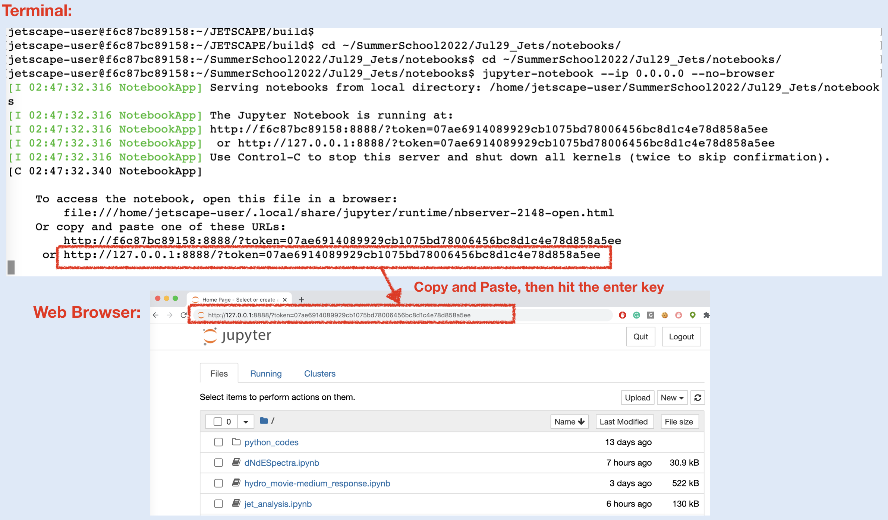
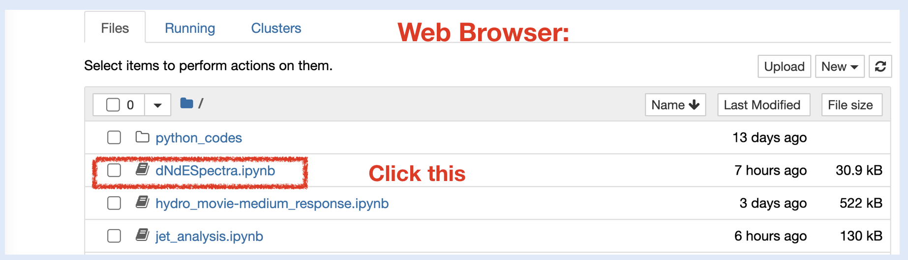
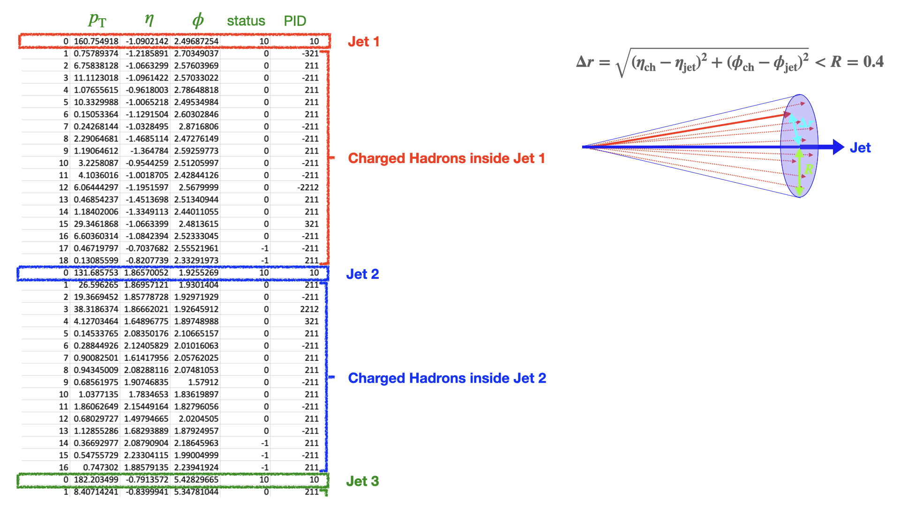
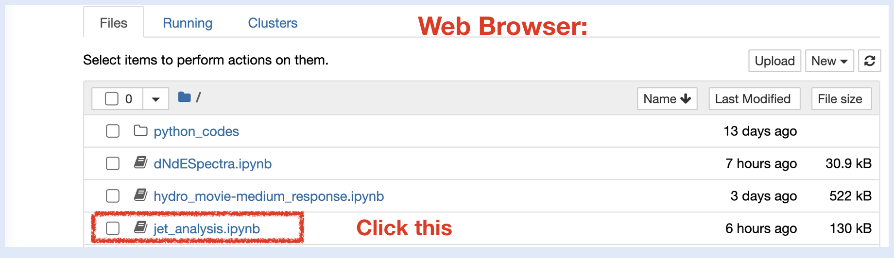
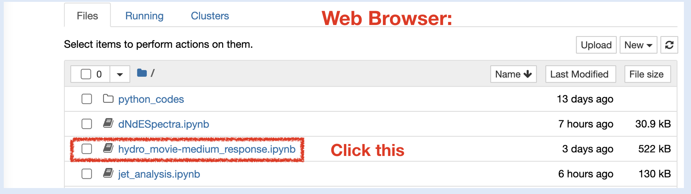

## <b>Hands-on session: Parton energy loss </b>

## Goals for this session
1. Learn how to setup XML file for a combinations of modules: Parton Gun, Hydro, MATTER, and LBT.
2. Visualize the parton shower graph generated by JETSCAPE framework using graphviz.
3. Learn how to setup nuclear PDF. Simulate pp and AA events and then, compute the nuclear modifications to jet spectrum. Also, compute jet fragmentation function and jet shape.
4. Hydrodynamic medium response in a strongly-coupled approach [by Ritoban Datta]
 
## <b>1. Getting started</b>


### <span style="color: orange; ">1.1. Start the Docker Container<span>

If you use ssh to do exercises on a remote computer, you need to create your ssh session with the following command: 

```
ssh -L 8888:127.0.0.1:8888 user@server
```

Then, you can start the docker container,

For MacOS
```
docker run -it -v ~/jetscape-docker:/home/jetscape-user --name myJetscape -p 8888:8888 jetscape/school:2023.1
```

For Linux
```
docker run -it -v ~/jetscape-docker:/home/jetscape-user --name myJetscape -p 8888:8888 --user $(id -u):$(id -g) jetscape/school:2023.1
```
If you get an error `permission denied` on Linux,
please try `sudo`.

The option `-p 8888:8888` is necessary to creates a port to access the jupyter notebook, which we use in this hands-on session, from your local web browser.

If you already created the docker container
```
docker start -ai myJetscape
```


### <span style="color: orange; ">1.2. Get Materials<span>


Inside the docker container, download the school material from git if you have not:

```
cd ~/
git clone https://github.com/JETSCAPE/SummerSchool2023.git
```

If you have alread downloaded the material, please update to the latest version:

```
cd ~/SummerSchool2023
git pull
```
  
Please also update X-SCAPE to the latest version:

```
cd ~/X-SCAPE 
git pull
```

Go to `~/X-Scape/examples` and download a test hydro profile by using following command.

```
./get_hydroSample_PbPb2760_cen_00-05.sh
```

This will download the bulk medium evolution file (initial state + hydro) as:

```
~/X-Scape/examples/test_hydro_files/event-0
```

### <span style="color: orange; ">1.3. Build X-SCAPE with LBT-tables, MUSIC and iSS</span>

Please make sure all the external code packages (LBT-tables, MUSIC and iSS) have been
downloaded in `X-SCAPE/external_packages`. You can check this by the following commands,

```
cd ~/X-SCAPE/external_packages
ls
```

Please check the folder `LBT-tables`, `music` and `iSS` are present.
If not, please get them with the following commands,

```
./get_lbtTab.sh
./get_music.sh
./get_iSS.sh
```

Setup and build X-SCAPE from inside the docker container:

```
cd ~/X-SCAPE
mkdir build
cd build
cmake .. -DCMAKE_CXX_STANDARD=14 -DUSE_MUSIC=ON -DUSE_ISS=ON
make -j 4
```
## <b>2. Toy models for jet energy loss</b>

### <span style="color: orange; ">2.1. Test Run and Graph Visualization</span>

Inside `build`, execute `runJetscape` with `jetscape_user_PP_PHYS.xml` in `SummerSchool2023/July21_Jets/config`

```
./runJetscape ../../SummerSchool2023/July21_Jets/config/jetscape_user_PbPb_PHYS_TestRun.xml
```

Check whether the code finished running without any error.

Then, lets' Visualize the parton shower. First, run `readerTest` inside `build`

```
./readerTest
```
By default, the executable `./readerTest` takes no argument.

Next, go <b><u>outside the docker</u></b>, install Graphviz (if you do not have). 

If you use Anaconda, you can get Graphviz via the command, 
```
conda install graphviz  
```

For MacOS via Homebrew
```
brew install graphviz
```

For MacOS via MacPorts
```
sudo port install graphviz
```

For Ubuntu or Debian
```
sudo apt install graphviz
```

For Fedora, Redhat, or CentOS
```
sudo yum install graphviz
```

Or inside docker terminal run:
```
pip install graphviz
```

Then, go `~/jetscape-docker/X-SCAPE/build` <b><u>outside the docker</u></b> and convert `my_test.gv` to a pdf file 
```
dot my_test.gv -Tpdf -o outputPDF.pdf
```

Open `outputPDF.pdf` in `build` with your pdf viewer and find the parton shower history.


### <span style="color: orange; ">2.2. Explore effect of model parameters  in the energy spectrum (dN/dE)  </span>

Generate 1000 events for the Exercieses 2.1 annd 2.3  annd create dN/dE spectrum as a function of energy E of the final state partons. To do this, we open the XML files `jetscape_user_PGun_MATTER_Vacuum.xml` and `jetscape_user_PGun_Hydro_MATTER_LBT.xml` 
 and set `<nEvents>100</nEvents>`

As usual, execute the following command to generate events:

```
./runJetscape ../../SummerSchool2023/July21_Jets/config/jetscape_user_PGun_MATTER_Vacuum.xml
./runJetscape ../../SummerSchool2023/July21_Jets/config/jetscape_user_PGun_Hydro_MATTER_LBT.xml

```

### <span style="color: orange; "> Analysis (with Jupyter Notebook)</span>

If you have already launched any jupyter notebooks outside the docker, please close them all first! Then, launch jupyter notebook in `SummerSchool2023/July21_Jets/notebooks` inside the docker container with the following command,

```
cd ~/SummerSchool2023/July21_Jets/notebooks
jupyter-notebook --ip 0.0.0.0 --no-browser
```

Open the displayed address starting with `http://127.0.0.1:8888/?token=...` in your browser. 




Then, please open `dNdESpectra.ipynb`, and follow the instructions.



Once you are done, please close jupyter notebook to continue the later part of the workshop. 

(Optional) One can follow the above procedure and explore the effects of changing parameters such as in-medium coupling, switching virtuality etc.

## <b>3. Jet events in pp and AA collisions</b>


Here we generates jet events for both pp and PbPb at Ecm=5.02 TeV.
On the second day, we will use the generated event data and do analysis for jet ovservables. 
In this example, for each of pp and PbPb, we are generating 50 hard scatterings with 100<$\hat{p}_T$<160 GeV. 
### <span style="color: orange; ">3.1. Run pp@5.02 TeV Events</span>

In `build` directory <b><u>inside the docker</u></b>, execute `runJetscape` with `jetscape_user_PP_PHYS.xml` in `SummerSchool2023/July21_Jets/config`

```
./runJetscape ../../SummerSchool2023/July21_Jets/config/jetscape_user_PP_PHYS.xml
```

The list of hadrons in the final states of events is stored in `test_out_pp_final_state_hadrons.dat`


### <span style="color: orange; ">3.2. Run PbPb@5.02 TeV Events</span>
In `build` directory <b><u>inside the docker</u></b>, execute `runJetscape` with `jetscape_user_PbPb_PHYS.xml` in `SummerSchool2023/July21_Jets/config`

```
./runJetscape ../../SummerSchool2023/July21_Jets/config/jetscape_user_PbPb_PHYS.xml
```
This takes <b><u>more than 10 mins</u></b>. 
The list of hadrons in the final states of events is stored in `test_out_pbpb_final_state_hadrons.dat`

## <b>4. Jet Analysis</b>

### <span style="color: orange; ">4.1. Initialization of the analysis environment<span>

Go to `SummerSchool2023/July21_Jets` directory and execute the script `init.sh` inside `SummerSchool2023/July21_Jets`:

```
cd ~/SummerSchool2023/July21_Jets
source ./init.sh
```

If you get any issue with pyhepmc_ng module, use following command to install the module.

```
pip install pyhepmc_ng
```

### <span style="color: orange; ">4.2. Jet Reconstruction</span>
Here using the final state hadron list from JETSCAPE as input, we reconstruct jet by anti-kt algorithm [https://arxiv.org/abs/0802.1189] with jet cone size, R=0.4 by FastJet [http://www.fastjet.fr]. In the output file from the analysis code, information of jets with $p_{\mathrm{T}}$ > 100 GeV and charged hadrons inside the jet cone (associated particles) will be stored. 

Now, let's go to `SummerSchool2023/July21_Jets/analysis_scripts` directory and find `jet_reconstruction.py`.
```
cd analysis_scripts
```


Then first, run `jet_reconstruction.py` for pp events:
```
python3 jet_reconstruction.py -i ../../../X-SCAPE/build/test_out_pp_final_state_hadrons.dat -o ../data/jet_pp.dat
```

Option `-i` is used to specify the input file path (final state hadron list)
and option `-o` is for the output file path 


Then, we run `jet_reconstruction.py` for PbPb events:
```
python3 jet_reconstruction.py -i ../../../X-SCAPE/build/test_out_pbpb_final_state_hadrons.dat -o ../data/jet_pbpb.dat
```

Once the analysis code finishes, you will find `jet_pp.dat` and `jet_pbpb.dat` 
in `SummerSchool2023/July21_Jets/data`
storing the information of reconstructed jets.

Inside those files, for each jet, the information of charged hadrons detected inside the jet cone (delta r < R =0.4) is stored in csv format:



### <span style="color: orange; ">4.3. Analysis (with Jupyter Notebook)</span>

If you have already launched any jupyter notebooks outside the docker, please close them all first! Then, launch jupyter notebook in `SummerSchool2023/July21_Jets/notebooks` inside the docker contain with the following command,

```
cd ~/SummerSchool2023/July21_Jets/notebooks
jupyter-notebook --ip 0.0.0.0 --no-browser
```

Open the displayed address starting with `http://127.0.0.1:8888/?token=...` in your browser. 


Then, we open `jet_analysis.ipynb`, and follow the instructions.



Once you have done, you can close the jupyter notebook to continue the later part of the workshop. 

## <b>5. Hydrodynamic Medium Response</b>
Here we see the pattern of hydrodynamic flow excited by the jet propagation in the medium by performing simulations of two-stage hydro with liquefier in JETSCAPE. 

First copy the following portion from `~/SummerSchool2023/July21_Jets/config/jetscape_user_twostagehydro_PHYS.xml` to main xml file at `~/X-Scape/config/jetscape_main.xml`.

```
  <!-- Create liquifier -->
  <Liquefier>
      <!-- CausalLiquefier -->
      <CausalLiquefier>
          <name>CausalLiquefier</name>
          <dtau>0.02</dtau><!-- fluid time step in [fm] -->
          <dx>0.3</dx><!-- fluid cell size in [fm] -->
          <dy>0.3</dy><!-- fluid cell size in [fm] -->
          <deta>0.2</deta><!-- fluid cell size -->
          <tau_delay>2.0</tau_delay><!-- in [fm] -->
          <time_relax>0.1</time_relax><!-- in [fm] -->
          <d_diff>0.08</d_diff><!-- in [fm] -->
          <width_delta>0.1</width_delta><!-- in [fm] -->
      </CausalLiquefier>
  </Liquefier>
```

### <span style="color: orange; ">2.1. Run Twostage Hydro of JETSCAPE</span>

Go to `~/X-SCAPE/build` and perform a simulation with hydrodynamic medium response: 

```
cd ~/X-SCAPE/build
./runJetscape ../../SummerSchool2023/July21_Jets/config/jetscape_user_twostagehydro_PHYS.xml 
```

### <span style="color: orange; ">2.2. Visualization with Jupyter Notebook</span>

Again, if you have already launched any jupyter notebooks outside the docker, please close them all first! Then, launch jupyter notebook in `SummerSchool2023/July21_Jets/notebooks` inside the docker contain with the following command,

```
cd ~/SummerSchool2023/July21_Jets/notebooks
jupyter-notebook --ip 0.0.0.0 --no-browser
```

Open the displayed address starting with `http://127.0.0.1:8888/?token=...` in your browser. 
Then please open `hydro_movie-medium_response.ipynb`, and follow the instructions.




